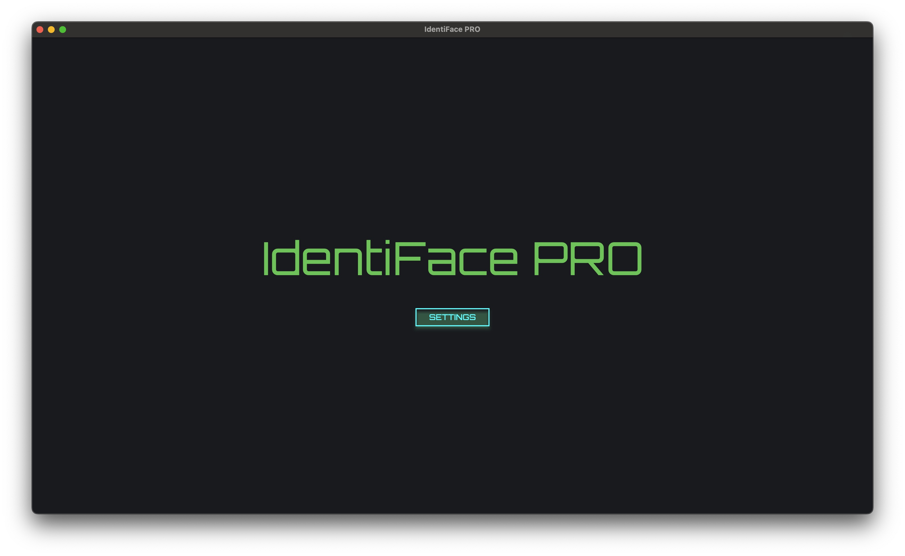
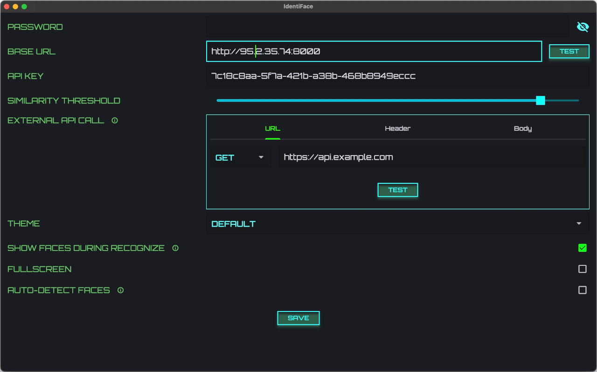
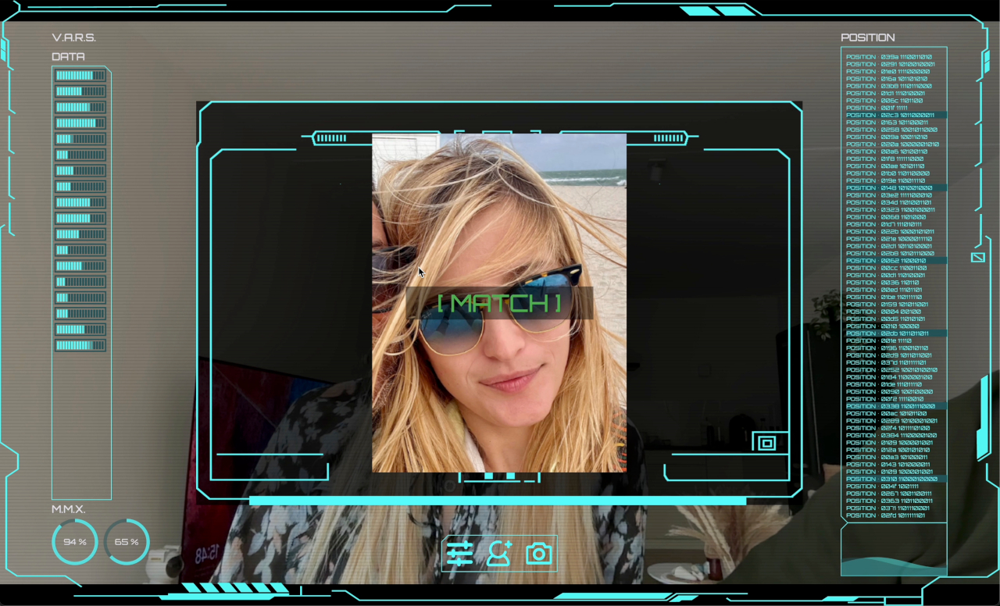
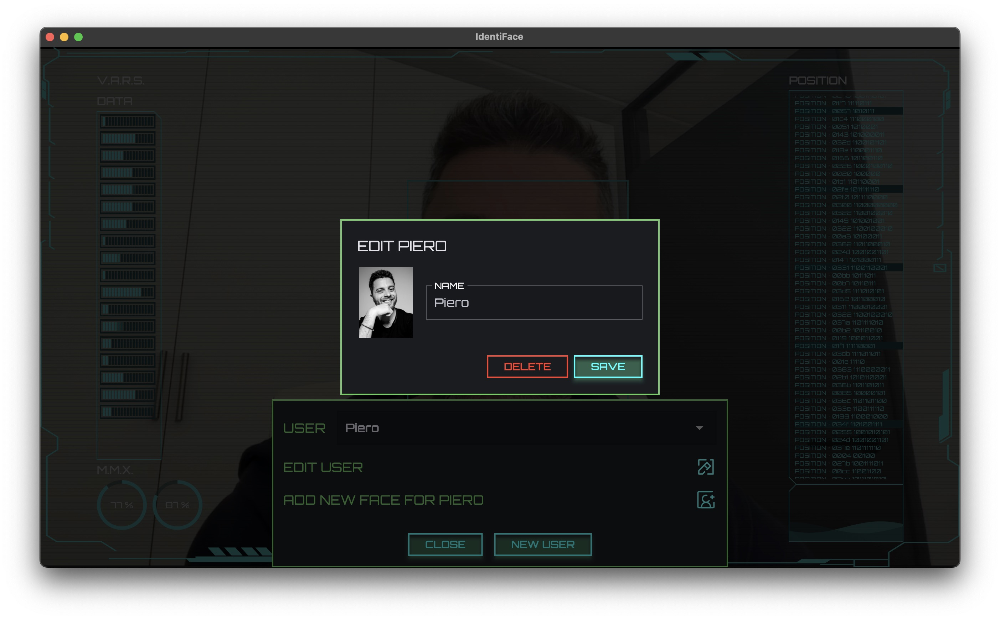
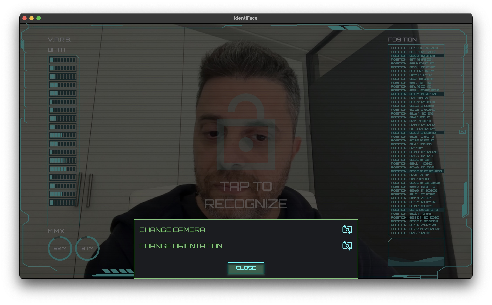
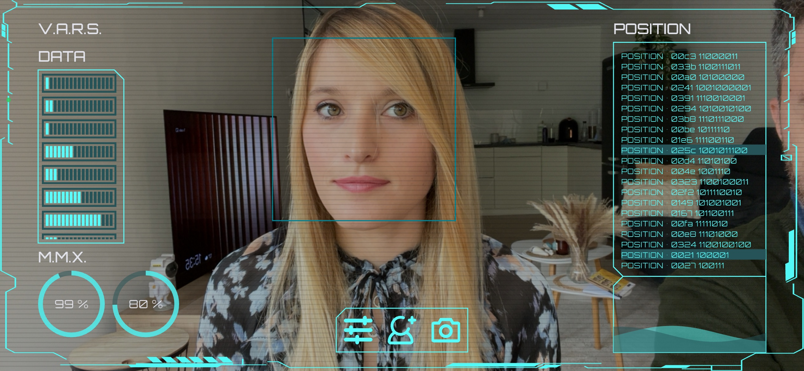
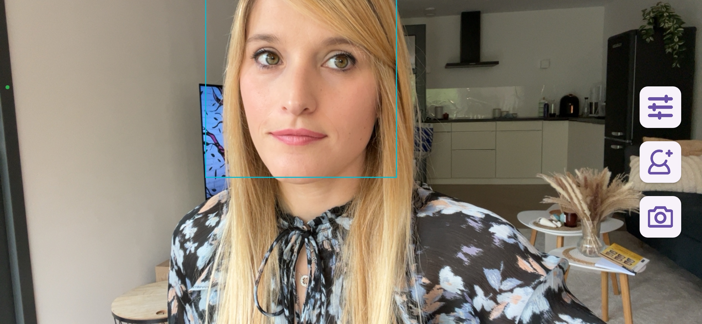
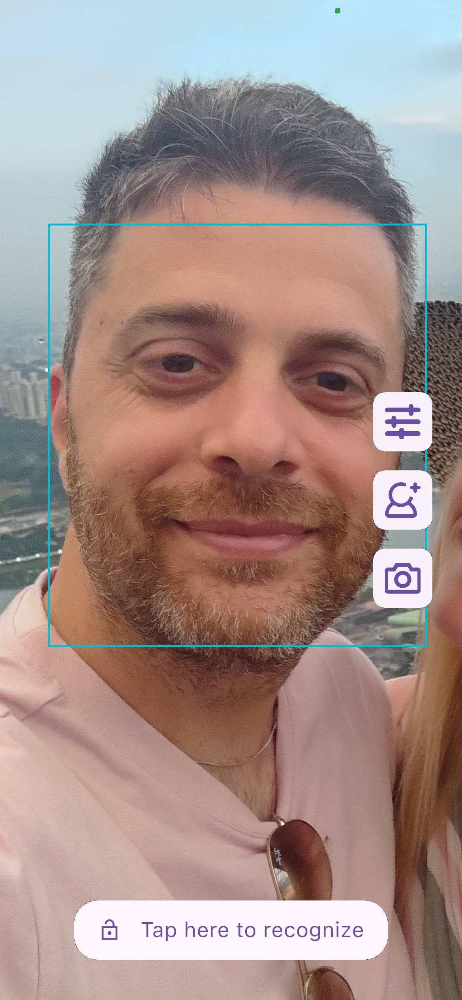
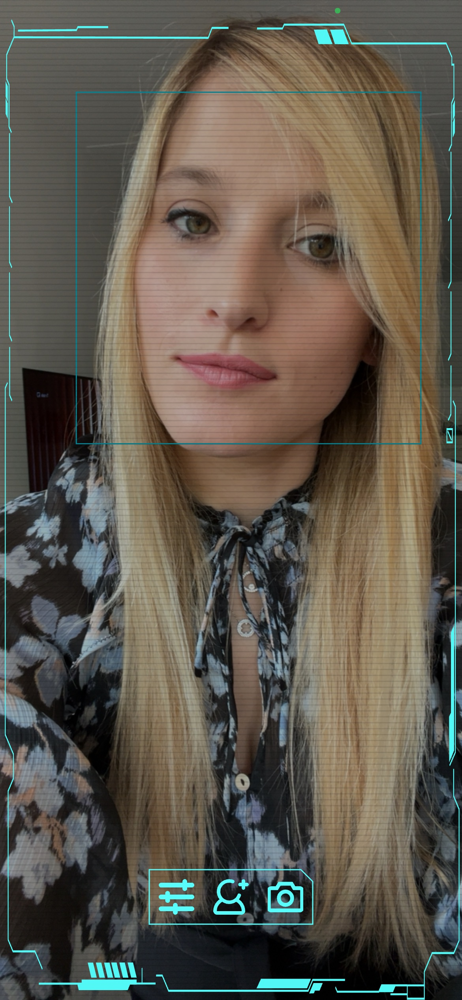

# IdentiFace

A minimalistic, responsive, multilanguage and powerful face recognition app for Android, iOS,
Desktop,
and Web, using [Compreface](https://github.com/exadel-inc/CompreFace) as backend.

Tutorial for setting up Compreface can be
found [here](https://scognito.wordpress.com/2024/09/02/how-to-configure-an-easy-free-and-open-source-face-recognition-service/).

Detail description of the app can be
found [here](https://scognito.wordpress.com/2024/09/02/how-to-configure-an-easy-free-and-open-source-face-recognition-service/).

The app comes with 2 themes: a default (cyberpunk style) and Material like.

The app can be used as a face recognition program that executes custom API calls once the face is
recognized, allowing integration with many things like home automation, IoT devices, etc.

One example of API could be opening remote doors, send notifications etc.

It is created as a standalone app,it doesn't store any user information except the avatar image
of the user (optional). No information is stored on the device.

## Get it

 

 

 
<!-- https://apps.microsoft.com/badge?hl=en-US&gl=US -->

## For devs

### Adding new backend service

The app is created with compreface as backend. You can use whatever backend you want, just edit
[api service](./lib/services/api_service.dart) accordingly.

### Adding new themes

Adding new theme is also easy: themes are located inside
the [theme directory](./lib/screens/recognize/theme/), you can add your theme in there too.

## Screenshots

<table>
    <tr>
        <td></td>
        <td></td>
    </tr>
    <tr>
        <td></td>
        <td></td>
    </tr>
    <tr>
        <td></td>
        <td></td>
    </tr>
    <tr>
        <td></td>
        <td></td>
    </tr>
    <tr>
        <td></td>
        <td></td> 
    </tr>
</table>

## Test API

Some sample API calls:

`curl -X GET "http://compreface-ip:8000/api/v1/recognition/subjects" \
-H "Content-Type: application/json" \
-H "x-api-key: your-api-key-here"`

`curl -X POST 'http://compreface-ip:8000/api/v1/recognition/recognize' \
-H 'x-api-key: your-api-key-here' \
-H 'Content-Type: multipart/form-data' \
-F 'userId=Piero' \
-F 'file=@/Users/scognito/Desktop/face.jpg'`

Full API
documentation [here]( https://github.com/exadel-inc/CompreFace/blob/master/docs/Rest-API-description.md).

# Run web with same configuration

--web-port 8000

# Linux support

Linux support is experimental, as the actual camera plugin is in early stage.

Note: You need to install libopencv-dev
